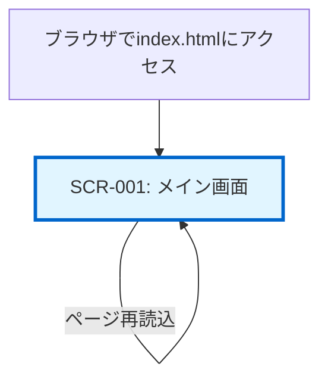
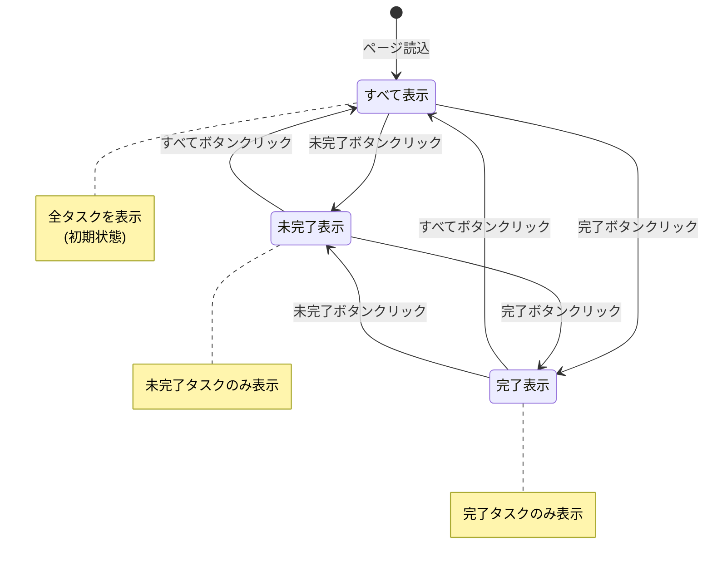
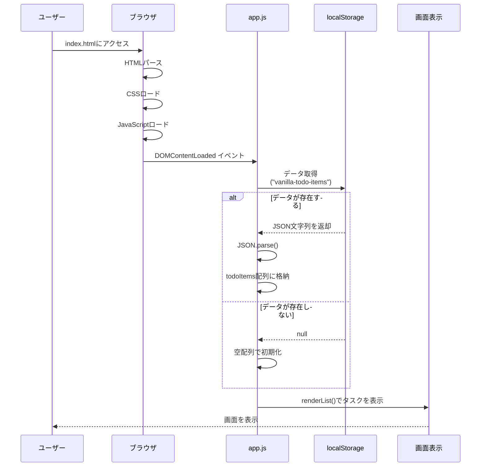

# 画面遷移図

## 1. ドキュメント情報

| 項目 | 内容 |
|-----|------|
| プロジェクト名 | vanilla-todo-fundamentals |
| ドキュメントバージョン | 1.0 |
| 作成日 | 2025-12-13 |
| 作成者 | Claude Code |
| 関連ドキュメント | 00_基本設計書.md, 02_画面一覧.md |

---

## 2. 画面遷移図

本アプリケーションは**シングルページアプリケーション（SPA）**のため、画面遷移は発生しない。

全ての操作はメイン画面（SCR-001）内で完結する。



---

## 3. 画面内の状態遷移

画面遷移は発生しないが、画面内でフィルタの状態が切り替わる。



---

## 4. 遷移条件一覧

| 遷移元 | 遷移先 | トリガー | 条件 | 備考 |
|-------|-------|---------|------|------|
| - | SCR-001 | ブラウザでindex.htmlを開く | - | 初回アクセス |
| SCR-001 | SCR-001 | ページ再読込（F5） | - | localStorageからデータ復元 |
| SCR-001 | SCR-001（すべて表示） | 「すべて」ボタンクリック | - | フィルタ状態の変更のみ |
| SCR-001 | SCR-001（未完了表示） | 「未完了」ボタンクリック | - | フィルタ状態の変更のみ |
| SCR-001 | SCR-001（完了表示） | 「完了」ボタンクリック | - | フィルタ状態の変更のみ |

**注**: 全ての操作は画面内で完結し、URLの変更は発生しない。

---

## 5. ページ読込フロー



---

## 6. 操作フロー（画面内遷移なし）

### 6.1 タスク追加フロー

```
[ユーザー]
    |
    | 1. 入力欄にテキスト入力
    | 2. 追加ボタンクリック（またはEnter）
    v
[画面内更新]
    |
    | 3. タスクリスト領域が再描画される
    v
[画面表示]（画面遷移なし）
```

### 6.2 タスク削除フロー

```
[ユーザー]
    |
    | 1. 削除ボタンクリック
    v
[画面内更新]
    |
    | 2. 該当タスクが消える
    v
[画面表示]（画面遷移なし）
```

### 6.3 完了切替フロー

```
[ユーザー]
    |
    | 1. チェックボックスクリック
    v
[画面内更新]
    |
    | 2. タスクのスタイルが変更される
    |    (取り消し線の付与/削除)
    v
[画面表示]（画面遷移なし）
```

### 6.4 フィルタ切替フロー

```
[ユーザー]
    |
    | 1. フィルタボタンクリック
    v
[画面内更新]
    |
    | 2. フィルタボタンのアクティブ状態が変わる
    | 3. タスクリストが再描画される
    v
[画面表示]（画面遷移なし）
```

---

## 7. 補足事項

### 7.1 SPAの特徴

- ページ遷移が発生しないため、ページ全体の再読込がない
- 操作のたびに部分的にDOMを更新する
- URLは常に`index.html`のまま変化しない

### 7.2 ブラウザ履歴

- ブラウザの戻る/進むボタンは使用しない
- 履歴管理（History API）は使用しない

### 7.3 データの永続化

- ページ再読込時、localStorageからデータを復元する
- ブラウザを閉じてもデータは保持される（localStorage使用のため）

---

## 8. 変更履歴

| 日付 | バージョン | 変更内容 | 変更者 |
|-----|-----------|---------|--------|
| 2025-12-13 | 1.0 | 初版作成 | Claude Code |
