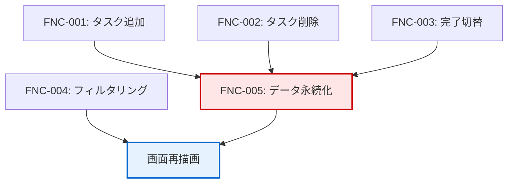

# 機能一覧

## 1. ドキュメント情報

| 項目 | 内容 |
|-----|------|
| プロジェクト名 | vanilla-todo-fundamentals |
| ドキュメントバージョン | 1.0 |
| 作成日 | 2025-12-13 |
| 作成者 | Claude Code |
| 関連ドキュメント | 00_基本設計書.md |

---

## 2. 機能一覧

| 機能ID | 機能名 | 概要 | 対応要件 | 対応画面 | 優先度 |
|--------|--------|------|---------|---------|--------|
| FNC-001 | タスク追加機能 | ユーザーが新しいタスクをリストに追加する | FR-001 | SCR-001 | SHALL |
| FNC-002 | タスク削除機能 | ユーザーが既存のタスクをリストから削除する | FR-002 | SCR-001 | SHALL |
| FNC-003 | 完了切替機能 | ユーザーがタスクの完了/未完了を切り替える | FR-003 | SCR-001 | SHALL |
| FNC-004 | フィルタリング機能 | ユーザーが表示するタスクを絞り込む | FR-004 | SCR-001 | SHALL |
| FNC-005 | データ永続化機能 | システムがタスクをlocalStorageに保存・復元する | FR-005 | SCR-001 | SHALL |

---

## 3. 機能カテゴリ分類

### 3.1 カテゴリ別分類

| カテゴリ | 機能ID | 機能名 |
|---------|--------|--------|
| **タスク管理** | FNC-001 | タスク追加機能 |
| **タスク管理** | FNC-002 | タスク削除機能 |
| **タスク管理** | FNC-003 | 完了切替機能 |
| **表示制御** | FNC-004 | フィルタリング機能 |
| **データ管理** | FNC-005 | データ永続化機能 |

---

## 4. 機能の実現方法

| 機能ID | UI要素 | イベント | 処理内容 |
|--------|--------|---------|---------|
| FNC-001 | 入力欄、追加ボタン | クリック、Enterキー | 入力値検証 → 配列追加 → localStorage保存 → 再描画 |
| FNC-002 | 削除ボタン | クリック | 配列から削除 → localStorage保存 → 再描画 |
| FNC-003 | チェックボックス | クリック | completedフラグ反転 → localStorage保存 → 再描画 |
| FNC-004 | フィルタボタン群 | クリック | フィルタ状態更新 → 再描画 |
| FNC-005 | - | ページ読込、各操作 | localStorage読込/保存 |

---

## 5. 機能間の依存関係

**依存関係の説明:**

- FNC-001、FNC-002、FNC-003はデータを変更するため、FNC-005（データ永続化）に依存する
- FNC-004はデータを変更せず、表示のみを制御する
- 全ての機能は画面再描画に依存する

---

## 6. 機能設計書の参照先

| 機能ID | 設計書ファイル |
|--------|---------------|
| FNC-001 | 06_機能設計書/FNC-001_タスク追加機能.md |
| FNC-002 | 06_機能設計書/FNC-002_タスク削除機能.md |
| FNC-003 | 06_機能設計書/FNC-003_完了切替機能.md |
| FNC-004 | 06_機能設計書/FNC-004_フィルタリング機能.md |
| FNC-005 | 06_機能設計書/FNC-005_データ永続化機能.md |

---

## 7. トレーサビリティマトリクス

### 7.1 要件→機能の対応

| 要件ID | 要件名 | 機能ID | 機能名 |
|--------|--------|--------|--------|
| FR-001 | ToDoアイテム追加 | FNC-001 | タスク追加機能 |
| FR-002 | ToDoアイテム削除 | FNC-002 | タスク削除機能 |
| FR-003 | 完了/未完了切り替え | FNC-003 | 完了切替機能 |
| FR-004 | フィルタリング表示 | FNC-004 | フィルタリング機能 |
| FR-005 | データ永続化 | FNC-005 | データ永続化機能 |

### 7.2 機能→ユースケースの対応

| 機能ID | 機能名 | ユースケースID | ユースケース名 |
|--------|--------|---------------|---------------|
| FNC-001 | タスク追加機能 | UC-001 | タスクを追加する |
| FNC-002 | タスク削除機能 | UC-002 | タスクを削除する |
| FNC-003 | 完了切替機能 | UC-003 | タスクを完了にする |
| FNC-003 | 完了切替機能 | UC-004 | タスクを未完了に戻す |
| FNC-004 | フィルタリング機能 | UC-005 | タスクを絞り込む |
| FNC-005 | データ永続化機能 | UC-006 | 保存データを復元する |

---

## 8. 変更履歴

| 日付 | バージョン | 変更内容 | 変更者 |
|-----|-----------|---------|--------|
| 2025-12-13 | 1.0 | 初版作成 | Claude Code |
