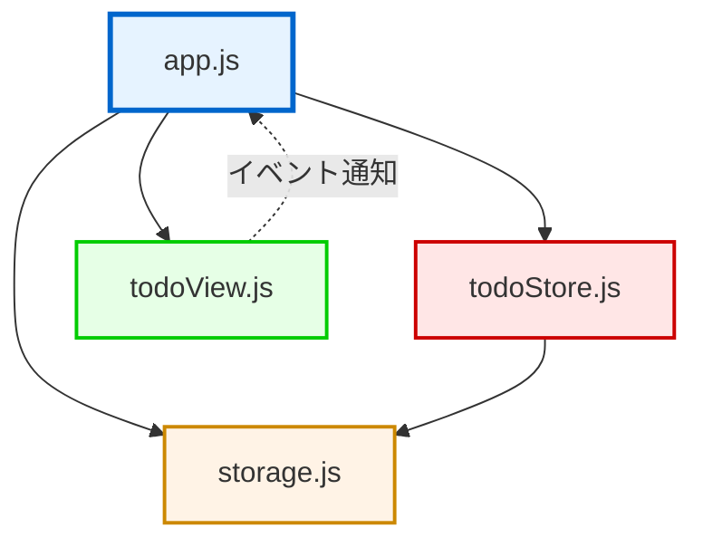

# 詳細設計書（内部設計書）

## 1. ドキュメント情報

| 項目 | 内容 |
|-----|------|
| プロジェクト名 | vanilla-todo-fundamentals |
| ドキュメントバージョン | 1.0 |
| 作成日 | 2025-12-13 |
| 作成者 | Claude Code |
| 関連ドキュメント | docs/requirements/, docs/design/external/ |

---

## 2. 内部設計の目的と範囲

### 2.1 目的

本詳細設計書は、vanilla-todo-fundamentalsプロジェクトの内部設計（詳細設計）を定義する。開発者が実装可能なレベルまで詳細化し、外部設計で定めた画面・機能をどのようにコードで実現するかを明確にする。

### 2.2 対象読者

- プロジェクト開発者（実装担当者）
- テスト担当者
- レビュアー
- ポートフォリオ閲覧者（技術評価者）

### 2.3 設計方針

| 方針ID | 方針名 | 内容 |
|--------|--------|------|
| POL-INT-001 | Vanilla JavaScript | フレームワーク・ライブラリを使用せず、素のJavaScriptで実装 |
| POL-INT-002 | モジュール分離 | 状態管理、UI描画、永続化を明確に分離 |
| POL-INT-003 | シンプル設計 | 学習目的のため、過度な抽象化は避ける |
| POL-INT-004 | テスト可能性 | 単体テストが書きやすい粒度に分割 |
| POL-INT-005 | ブラウザAPI活用 | localStorage、DOM APIを直接利用 |

---

## 3. アーキテクチャ設計

### 3.1 レイヤー構成

本アプリは単一ページアプリケーション（SPA）であり、以下の責務に基づいてモジュールを分割する：

```
+------------------------------------------+
|           index.html (View)              |
|  - セマンティックHTML構造                |
|  - ARIA属性によるアクセシビリティ        |
+------------------------------------------+
               ↑ DOM操作
+------------------------------------------+
|         app.js (Controller)              |
|  - イベントハンドリング                  |
|  - アプリケーションフロー制御            |
|  - 各モジュールの統合                    |
+------------------------------------------+
       ↓                ↓              ↓
+-------------+  +--------------+  +-------------+
| todoStore.js|  | todoView.js  |  | storage.js  |
| (Model)     |  | (View)       |  | (Storage)   |
+-------------+  +--------------+  +-------------+
| - 状態管理  |  | - DOM生成    |  | - localStorage|
| - データ更新|  | - UI更新     |  |   読み書き   |
+-------------+  +--------------+  +-------------+
                                         ↓
                                  +-------------+
                                  | localStorage|
                                  | (Browser)   |
                                  +-------------+
```

### 3.2 ファイル構成

```
vanilla-todo-fundamentals/
├── index.html           # メインHTML（UI構造）
├── styles.css           # スタイルシート
├── js/
│   ├── app.js           # メインコントローラー（エントリーポイント）
│   ├── todoStore.js     # タスク状態管理モジュール
│   ├── todoView.js      # UI描画モジュール
│   └── storage.js       # localStorage操作モジュール
└── docs/
    └── design/
        └── internal/    # 本ドキュメント群
```

### 3.3 モジュール間の依存関係



**依存関係の説明:**
- `app.js` はすべてのモジュールを統合する中心モジュール
- `todoStore.js` はデータの真実の単一情報源（Single Source of Truth）
- `todoView.js` はDOMのみを操作し、状態を持たない
- `storage.js` はlocalStorageの読み書きを担当
- 循環依存は存在しない

---

## 4. モジュール設計（クラス設計相当）

本プロジェクトは素のJavaScriptを使用するため、「クラス設計」の代わりに「モジュール設計」として定義する。

### 4.1 モジュール一覧

| モジュールID | モジュール名 | ファイル | 責務 | 対応機能 |
|------------|------------|---------|------|---------|
| MOD-001 | todoStore | todoStore.js | タスクデータの状態管理 | FNC-001, FNC-002, FNC-003 |
| MOD-002 | todoView | todoView.js | DOM生成・UI描画 | FNC-001, FNC-002, FNC-003, FNC-004 |
| MOD-003 | storage | storage.js | localStorage操作 | FNC-005 |
| MOD-004 | app | app.js | アプリケーション統合・イベント処理 | 全機能 |

### 4.2 モジュール設計書の参照先

各モジュールの詳細設計は以下のファイルに記載：

| モジュールID | 設計書ファイル |
|------------|---------------|
| MOD-001 | 01_モジュール設計/MOD-001_todoStore.md |
| MOD-002 | 01_モジュール設計/MOD-002_todoView.md |
| MOD-003 | 01_モジュール設計/MOD-003_storage.md |
| MOD-004 | 01_モジュール設計/MOD-004_app.md |

---

## 5. シーケンス図

主要な処理フローのシーケンス図を以下のファイルに記載：

| シーケンスID | 処理名 | ファイル | 対応機能 |
|------------|--------|---------|---------|
| SEQ-001 | タスク追加処理 | 02_シーケンス図/SEQ-001_タスク追加処理.md | FNC-001 |
| SEQ-002 | タスク削除処理 | 02_シーケンス図/SEQ-002_タスク削除処理.md | FNC-002 |
| SEQ-003 | 完了切替処理 | 02_シーケンス図/SEQ-003_完了切替処理.md | FNC-003 |
| SEQ-004 | フィルタリング処理 | 02_シーケンス図/SEQ-004_フィルタリング処理.md | FNC-004 |
| SEQ-005 | 初期化処理 | 02_シーケンス図/SEQ-005_初期化処理.md | FNC-005 |

---

## 6. データ構造設計

### 6.1 タスクオブジェクト

```typescript
// TypeScript型定義（参考）
interface TodoItem {
  id: string;           // "task-{タイムスタンプ}" 形式
  text: string;         // タスク内容（最大200文字）
  completed: boolean;   // 完了フラグ
  createdAt: string;    // 作成日時（ISO 8601形式）
}
```

**例:**
```javascript
{
  "id": "task-1702468800000",
  "text": "買い物に行く",
  "completed": false,
  "createdAt": "2025-12-13T10:00:00.000Z"
}
```

### 6.2 アプリケーション状態

```javascript
// グローバル状態（app.js内で管理）
const appState = {
  todos: [],              // TodoItem[] タスク配列
  currentFilter: 'all'    // 'all' | 'active' | 'completed'
};
```

### 6.3 localStorage保存形式

| 項目 | 内容 |
|-----|------|
| キー | `vanilla-todo-items` |
| 値 | JSON文字列（TodoItem配列） |
| 例 | `'[{"id":"task-123","text":"買い物","completed":false,"createdAt":"2025-12-13T10:00:00.000Z"}]'` |

---

## 7. 共通処理設計

共通処理の詳細は以下のファイルに記載：

- `06_共通処理設計書.md`

### 7.1 共通処理一覧

| 処理ID | 処理名 | 概要 | 使用箇所 |
|-------|--------|------|---------|
| COM-001 | ID生成 | ユニークなタスクIDを生成 | MOD-001 |
| COM-002 | 入力値検証 | タスクテキストのバリデーション | MOD-001, MOD-004 |
| COM-003 | フィルタリング | タスク配列をフィルタ条件で絞り込み | MOD-001 |
| COM-004 | エラーハンドリング | try-catchによるエラー処理 | MOD-003 |

---

## 8. イベント設計

### 8.1 DOMイベント一覧

| イベント名 | 対象要素 | トリガー | ハンドラ | 処理概要 |
|-----------|---------|---------|---------|---------|
| DOMContentLoaded | document | ページ読込完了 | init() | アプリ初期化 |
| click | #add-button | 追加ボタンクリック | handleAddTodo() | タスク追加 |
| keypress | #todo-input | Enterキー押下 | handleAddTodo() | タスク追加 |
| change | input[type="checkbox"] | チェックボックス変更 | handleToggleTodo(id) | 完了切替 |
| click | .delete-button | 削除ボタンクリック | handleDeleteTodo(id) | タスク削除 |
| click | .filter-button | フィルタボタンクリック | handleFilterChange(filter) | フィルタ変更 |

### 8.2 イベント委譲

動的に生成されるタスクアイテムのイベントは、親要素（`#todo-list`）に委譲する：

```javascript
document.getElementById('todo-list').addEventListener('click', (event) => {
  if (event.target.classList.contains('delete-button')) {
    const id = event.target.dataset.id;
    handleDeleteTodo(id);
  }
});
```

---

## 9. エラーハンドリング設計

### 9.1 エラー処理方針

| エラー種別 | 処理方針 |
|-----------|---------|
| localStorage読込エラー | コンソールログ出力、空配列で初期化 |
| localStorage保存エラー | コンソールログ出力、次回操作時に再試行 |
| JSON.parse()エラー | コンソールログ出力、破損データ削除、空配列で初期化 |
| 入力バリデーションエラー | 静かに無視（エラーメッセージ非表示） |

### 9.2 エラーログ形式

```javascript
console.error('[vanilla-todo-fundamentals] エラー内容:', error);
```

---

## 10. パフォーマンス設計

### 10.1 最適化方針

| 項目 | 方針 |
|-----|------|
| DOM操作 | 必要最小限の再描画（innerHTML一括更新） |
| イベントリスナー | イベント委譲で登録数を削減 |
| localStorage | 各操作後に即座に保存（バッチ保存は不要） |
| データ量 | 最大1000件までのタスクを想定（NFR-003-06） |

### 10.2 再描画戦略

```javascript
// 全体再描画（シンプル設計のため）
function render() {
  const filteredTodos = filterTodos(appState.todos, appState.currentFilter);
  const html = generateTodoListHTML(filteredTodos);
  document.getElementById('todo-list').innerHTML = html;
}
```

**注**: 本アプリは学習目的のため、仮想DOM等の高度な最適化は行わない。

---

## 11. セキュリティ設計

### 11.1 XSS対策

| 対策 | 実装方法 |
|-----|---------|
| テキストのエスケープ | `textContent`プロパティを使用（`innerHTML`は避ける） |
| ユーザー入力のサニタイズ | `trim()`で前後の空白除去、200文字制限 |

```javascript
// ❌ 危険（XSS脆弱性）
element.innerHTML = `<span>${userInput}</span>`;

// ✅ 安全
element.textContent = userInput;
```

### 11.2 データ保護

| 項目 | 方針 |
|-----|------|
| 機密情報 | 本アプリは機密情報を扱わない |
| localStorage | 平文保存（暗号化不要） |
| アクセス制御 | Same-Origin Policyでオリジン外からのアクセス防止 |

---

## 12. アクセシビリティ設計

### 12.1 ARIA属性

| 要素 | ARIA属性 | 目的 |
|------|---------|------|
| 入力欄 | `aria-label="新しいタスク"` | スクリーンリーダー対応 |
| フィルタボタン | `aria-label="すべてのタスクを表示"` | ボタンの意味を明示 |
| タスクリスト | `role="list"` | リストの意味を明示 |
| 空メッセージ | `role="status"` | 状態変化を通知 |

### 12.2 キーボード操作

全てのインタラクティブ要素は、ブラウザのデフォルト動作でキーボード操作可能：

- `Tab`キーでフォーカス移動
- `Enter`/`Space`キーでボタン・チェックボックス操作

---

## 13. テスト設計方針

### 13.1 単体テスト

| モジュール | テスト対象 | ツール（推奨） |
|-----------|-----------|--------------|
| todoStore.js | データ操作関数 | Jest / Vitest |
| todoView.js | HTML生成関数 | Jest / Vitest |
| storage.js | localStorage操作 | Jest / Vitest（モック使用） |

### 13.2 E2Eテスト

| テストケース | ツール（推奨） |
|------------|--------------|
| タスク追加・削除・完了切替 | Playwright |
| フィルタリング動作 | Playwright |
| データ永続化 | Playwright |

---

## 14. トレーサビリティマトリクス

### 14.1 要件→モジュールの対応

| 要件ID | 要件名 | モジュールID | シーケンスID |
|--------|--------|------------|------------|
| FR-001 | ToDoアイテム追加 | MOD-001, MOD-002, MOD-003, MOD-004 | SEQ-001 |
| FR-002 | ToDoアイテム削除 | MOD-001, MOD-002, MOD-003, MOD-004 | SEQ-002 |
| FR-003 | 完了/未完了切り替え | MOD-001, MOD-002, MOD-003, MOD-004 | SEQ-003 |
| FR-004 | フィルタリング表示 | MOD-001, MOD-002, MOD-004 | SEQ-004 |
| FR-005 | データ永続化 | MOD-003 | SEQ-005 |

### 14.2 画面→モジュールの対応

| 画面ID | 画面名 | モジュールID |
|--------|--------|------------|
| SCR-001 | メイン画面 | MOD-001, MOD-002, MOD-003, MOD-004 |

### 14.3 機能→モジュールの対応

| 機能ID | 機能名 | モジュールID | 共通処理ID |
|--------|--------|------------|-----------|
| FNC-001 | タスク追加機能 | MOD-001, MOD-004 | COM-001, COM-002 |
| FNC-002 | タスク削除機能 | MOD-001, MOD-004 | - |
| FNC-003 | 完了切替機能 | MOD-001, MOD-004 | - |
| FNC-004 | フィルタリング機能 | MOD-001, MOD-004 | COM-003 |
| FNC-005 | データ永続化機能 | MOD-003 | COM-004 |

---

## 15. 実装上の制約

### 15.1 技術制約

| 制約ID | 制約内容 |
|--------|---------|
| CON-INT-001 | ES6+構文を使用（const, let, アロー関数, テンプレートリテラル等） |
| CON-INT-002 | モダンブラウザのみ対象（Chrome, Firefox, Edge, Safari最新版） |
| CON-INT-003 | Polyfillは使用しない |
| CON-INT-004 | ビルドツール・トランスパイラは使用しない |

### 15.2 設計制約

| 制約ID | 制約内容 |
|--------|---------|
| CON-INT-005 | グローバル変数の使用は最小限（appStateのみ） |
| CON-INT-006 | 各モジュールは独立してテスト可能であること |
| CON-INT-007 | 循環依存を作らない |

---

## 16. 実装優先順位

### 16.1 開発順序

```
1. storage.js         # localStorage操作（最小単位）
2. todoStore.js       # 状態管理（storage.jsに依存）
3. todoView.js        # UI描画（独立）
4. app.js             # 統合（全モジュールに依存）
5. index.html         # HTML構造
6. styles.css         # スタイリング
```

### 16.2 実装マイルストーン

| マイルストーン | 完了条件 | 対応機能 |
|--------------|---------|---------|
| M1: データ永続化 | localStorageの読み書きが動作 | FNC-005 |
| M2: タスク追加 | タスク追加・表示が動作 | FNC-001 |
| M3: タスク削除 | タスク削除が動作 | FNC-002 |
| M4: 完了切替 | 完了切替が動作 | FNC-003 |
| M5: フィルタリング | フィルタリングが動作 | FNC-004 |

---

## 17. レビューチェックリスト

### 17.1 モジュール設計レビュー

- [ ] 各モジュールの責務は単一で明確か
- [ ] モジュール間の依存関係は一方向か（循環依存なし）
- [ ] 各モジュールは独立してテスト可能か
- [ ] グローバル変数の使用は最小限か

### 17.2 セキュリティレビュー

- [ ] ユーザー入力はエスケープされているか
- [ ] XSS脆弱性はないか（innerHTML使用時は要確認）
- [ ] localStorageのデータ検証は適切か

### 17.3 パフォーマンスレビュー

- [ ] 不要なDOM操作は削減されているか
- [ ] イベントリスナーは適切に登録されているか（メモリリークなし）
- [ ] localStorage保存頻度は適切か

### 17.4 アクセシビリティレビュー

- [ ] ARIA属性は適切に設定されているか
- [ ] キーボード操作で全機能が使用可能か
- [ ] フォーカス表示は明確か

---

## 18. 変更履歴

| 日付 | バージョン | 変更内容 | 変更者 |
|-----|-----------|---------|--------|
| 2025-12-13 | 1.0 | 初版作成 | Claude Code |
