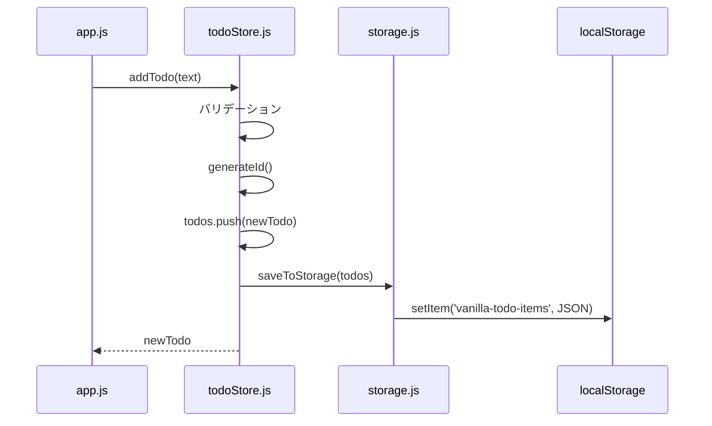

# モジュール定義書: MOD-001 todoStore

## 1. 基本情報

| 項目 | 内容 |
|-----|------|
| モジュールID | MOD-001 |
| モジュール名 | todoStore |
| ファイル名 | todoStore.js |
| 責務 | タスクデータの状態管理とビジネスロジック |
| 対応要件 | FR-001, FR-002, FR-003, FR-004 |
| 対応画面 | SCR-001 |
| 作成日 | 2025-12-13 |
| 更新日 | 2025-12-13 |

---

## 2. 概要

todoStoreモジュールは、タスクデータの状態管理を担当する。タスクの追加・削除・更新・フィルタリングなどのビジネスロジックを提供し、データの真実の単一情報源（Single Source of Truth）として機能する。

---

## 3. 依存関係

| 依存先モジュール | 用途 |
|----------------|------|
| storage.js (MOD-003) | タスクデータの永続化 |

---

## 4. エクスポート関数一覧

| 関数名 | 引数 | 戻り値 | 概要 |
|-------|------|--------|------|
| getTodos() | - | TodoItem[] | 全タスクを取得 |
| addTodo(text) | text: string | TodoItem | タスクを追加 |
| deleteTodo(id) | id: string | boolean | タスクを削除 |
| toggleTodo(id) | id: string | boolean | タスクの完了状態を切り替え |
| filterTodos(filter) | filter: string | TodoItem[] | フィルタ条件に合致するタスクを取得 |
| loadTodos() | - | void | localStorageからタスクを読み込み |

---

## 5. 内部状態

```javascript
// モジュール内プライベート変数
let todos = []; // TodoItem[]
```

**型定義（参考）:**
```typescript
interface TodoItem {
  id: string;           // "task-{タイムスタンプ}"
  text: string;         // タスク内容（最大200文字）
  completed: boolean;   // 完了フラグ
  createdAt: string;    // 作成日時（ISO 8601形式）
}
```

---

## 6. 関数詳細

### 6.1 getTodos()

| 項目 | 内容 |
|-----|------|
| 概要 | 現在の全タスクを取得する |
| 引数 | なし |
| 戻り値 | TodoItem[] - タスク配列 |
| 副作用 | なし |

**実装例:**
```javascript
export function getTodos() {
  return todos;
}
```

---

### 6.2 addTodo(text)

| 項目 | 内容 |
|-----|------|
| 概要 | 新しいタスクを追加する |
| 引数 | text: string - タスク内容 |
| 戻り値 | TodoItem - 追加されたタスク |
| 例外 | textが空の場合は追加せず、nullを返す |
| 副作用 | todos配列を更新、localStorageに保存 |

**処理フロー:**
1. 入力値のバリデーション（空チェック、文字数制限）
2. 新しいタスクオブジェクトを生成
3. todos配列に追加
4. localStorageに保存
5. 追加したタスクを返却

**実装例:**
```javascript
export function addTodo(text) {
  const trimmed = text.trim();

  if (trimmed === '') {
    return null; // 空の場合は追加しない
  }

  const truncated = trimmed.substring(0, 200); // 200文字で切り捨て

  const newTodo = {
    id: generateId(),
    text: truncated,
    completed: false,
    createdAt: new Date().toISOString()
  };

  todos.push(newTodo);
  saveTodosToStorage();

  return newTodo;
}
```

**バリデーション:**
- 入力値の前後空白を除去（trim）
- 空文字の場合はnullを返却
- 201文字以上の場合は200文字で切り捨て

---

### 6.3 deleteTodo(id)

| 項目 | 内容 |
|-----|------|
| 概要 | 指定IDのタスクを削除する |
| 引数 | id: string - タスクID |
| 戻り値 | boolean - 削除成功ならtrue、失敗ならfalse |
| 副作用 | todos配列を更新、localStorageに保存 |

**処理フロー:**
1. todos配列から該当IDのタスクを検索
2. 見つかった場合は配列から削除
3. localStorageに保存
4. 削除成功ならtrue、IDが見つからない場合はfalseを返却

**実装例:**
```javascript
export function deleteTodo(id) {
  const index = todos.findIndex(todo => todo.id === id);

  if (index === -1) {
    return false; // IDが見つからない
  }

  todos.splice(index, 1);
  saveTodosToStorage();

  return true;
}
```

---

### 6.4 toggleTodo(id)

| 項目 | 内容 |
|-----|------|
| 概要 | 指定IDのタスクの完了状態を反転する |
| 引数 | id: string - タスクID |
| 戻り値 | boolean - 切替成功ならtrue、失敗ならfalse |
| 副作用 | todos配列を更新、localStorageに保存 |

**処理フロー:**
1. todos配列から該当IDのタスクを検索
2. 見つかった場合はcompletedフラグを反転
3. localStorageに保存
4. 切替成功ならtrue、IDが見つからない場合はfalseを返却

**実装例:**
```javascript
export function toggleTodo(id) {
  const todo = todos.find(todo => todo.id === id);

  if (!todo) {
    return false; // IDが見つからない
  }

  todo.completed = !todo.completed;
  saveTodosToStorage();

  return true;
}
```

---

### 6.5 filterTodos(filter)

| 項目 | 内容 |
|-----|------|
| 概要 | フィルタ条件に合致するタスクを取得する |
| 引数 | filter: string - 'all', 'active', 'completed' |
| 戻り値 | TodoItem[] - フィルタされたタスク配列 |
| 副作用 | なし（状態変更なし） |

**フィルタ条件:**
- `'all'`: 全タスクを返却
- `'active'`: completed === false のタスクのみ
- `'completed'`: completed === true のタスクのみ
- その他: 空配列を返却

**実装例:**
```javascript
export function filterTodos(filter) {
  switch (filter) {
    case 'all':
      return todos;
    case 'active':
      return todos.filter(todo => !todo.completed);
    case 'completed':
      return todos.filter(todo => todo.completed);
    default:
      return [];
  }
}
```

---

### 6.6 loadTodos()

| 項目 | 内容 |
|-----|------|
| 概要 | localStorageからタスクデータを読み込む |
| 引数 | なし |
| 戻り値 | void |
| 副作用 | todos配列を更新 |

**処理フロー:**
1. storage.jsのload()を呼び出し
2. 取得したデータをtodos配列に格納
3. データが存在しない場合は空配列で初期化

**実装例:**
```javascript
export function loadTodos() {
  const loadedTodos = loadFromStorage();
  todos = loadedTodos || [];
}
```

---

## 7. 内部ヘルパー関数

### 7.1 generateId()

| 項目 | 内容 |
|-----|------|
| 概要 | ユニークなタスクIDを生成する |
| 引数 | なし |
| 戻り値 | string - "task-{タイムスタンプ}" 形式のID |

**実装例:**
```javascript
function generateId() {
  return `task-${Date.now()}`;
}
```

**ID形式:**
```
"task-1702468800000"
```

**ユニーク性の保証:**
- `Date.now()`はミリ秒単位のタイムスタンプを返す
- 同一ミリ秒内に複数のタスクが追加される可能性は極めて低い
- 万が一重複した場合、最後に追加されたタスクが優先される（実務では要改善）

---

### 7.2 saveTodosToStorage()

| 項目 | 内容 |
|-----|------|
| 概要 | 現在のtodos配列をlocalStorageに保存する |
| 引数 | なし |
| 戻り値 | void |

**実装例:**
```javascript
function saveTodosToStorage() {
  saveToStorage(todos);
}
```

---

## 8. データフロー



---

## 9. エラーハンドリング

| エラーケース | 対処 |
|------------|------|
| addTodo(空文字) | nullを返却、エラーなし |
| deleteTodo(存在しないID) | falseを返却、エラーなし |
| toggleTodo(存在しないID) | falseを返却、エラーなし |
| filterTodos(不正なフィルタ) | 空配列を返却 |

**注**: 本モジュールは例外をスローせず、エラー時は静かに失敗する設計。

---

## 10. テストケース

### 10.1 addTodo()のテスト

| テストケース | 入力 | 期待結果 |
|------------|------|---------|
| 正常: 通常のタスク | "買い物に行く" | タスクが追加される |
| 正常: 200文字 | "a" × 200 | タスクが追加される |
| 境界値: 201文字 | "a" × 201 | 200文字で切り捨てられる |
| 異常: 空文字 | "" | nullが返る |
| 異常: 空白のみ | "   " | nullが返る |
| 正常: 前後空白 | "  タスク  " | "タスク"として追加される |

### 10.2 deleteTodo()のテスト

| テストケース | 前提条件 | 入力 | 期待結果 |
|------------|---------|------|---------|
| 正常: タスク削除 | タスクが1件存在 | 存在するID | true、タスクが削除される |
| 異常: 存在しないID | タスクが0件 | "task-999" | false、変化なし |

### 10.3 toggleTodo()のテスト

| テストケース | 前提条件 | 入力 | 期待結果 |
|------------|---------|------|---------|
| 正常: 未完了→完了 | completedがfalse | 存在するID | true、completedがtrue |
| 正常: 完了→未完了 | completedがtrue | 存在するID | true、completedがfalse |
| 異常: 存在しないID | - | "task-999" | false、変化なし |

### 10.4 filterTodos()のテスト

| テストケース | 前提条件 | 入力 | 期待結果 |
|------------|---------|------|---------|
| 正常: すべて | 未完了2件、完了1件 | "all" | 3件返却 |
| 正常: 未完了のみ | 未完了2件、完了1件 | "active" | 2件返却 |
| 正常: 完了のみ | 未完了2件、完了1件 | "completed" | 1件返却 |
| 異常: 不正なフィルタ | - | "invalid" | 空配列返却 |

---

## 11. パフォーマンス考慮

| 項目 | 考慮内容 |
|-----|---------|
| 配列操作 | `findIndex()`, `filter()`を使用（O(n)） |
| ID検索 | 線形探索（タスク数が1000件以下なら問題なし） |
| localStorage保存 | 各操作後に即座に保存（頻度は高いが、データ量が小さいため影響なし） |

**改善の余地:**
- タスク数が10,000件を超える場合、Map構造でのID管理を検討
- 保存頻度を減らす（debounce処理）

---

## 12. 関連モジュール

| モジュールID | 関連内容 |
|------------|---------|
| MOD-003 (storage.js) | データの永続化を委譲 |
| MOD-004 (app.js) | 本モジュールの関数を呼び出す |

---

## 13. 変更履歴

| 日付 | バージョン | 変更内容 | 変更者 |
|-----|-----------|---------|--------|
| 2025-12-13 | 1.0 | 初版作成 | Claude Code |
