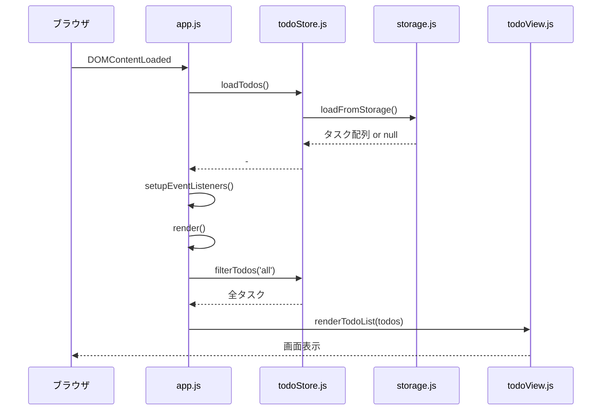
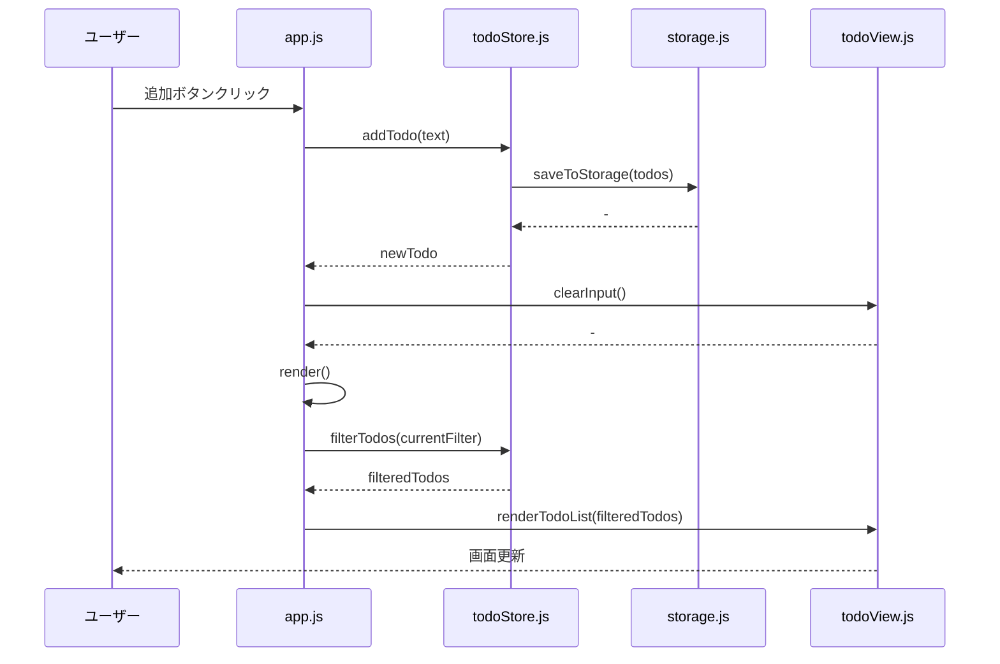

# モジュール定義書: MOD-004 app

## 1. 基本情報

| 項目 | 内容 |
|-----|------|
| モジュールID | MOD-004 |
| モジュール名 | app |
| ファイル名 | app.js |
| 責務 | アプリケーション統合とイベントハンドリング |
| 対応要件 | FR-001, FR-002, FR-003, FR-004, FR-005 |
| 対応画面 | SCR-001 |
| 作成日 | 2025-12-13 |
| 更新日 | 2025-12-13 |

---

## 2. 概要

appモジュールは、アプリケーションのエントリーポイントであり、全モジュールを統合する。DOMイベントのハンドリング、ユーザー操作のフロー制御、各モジュールの呼び出しを担当する。

**責務:**
- アプリケーション初期化
- DOMイベントリスナーの登録
- ユーザー操作のハンドリング
- 各モジュール間の連携

---

## 3. 依存関係

| 依存先モジュール | 用途 |
|----------------|------|
| todoStore.js (MOD-001) | タスクデータの状態管理 |
| todoView.js (MOD-002) | UI描画 |
| storage.js (MOD-003) | データ永続化 |

---

## 4. アプリケーション状態

```javascript
// グローバル変数（モジュールスコープ）
let currentFilter = 'all'; // 'all' | 'active' | 'completed'
```

---

## 5. 関数一覧

### 5.1 初期化関数

| 関数名 | 引数 | 戻り値 | 概要 |
|-------|------|--------|------|
| init() | - | void | アプリケーション初期化 |
| setupEventListeners() | - | void | イベントリスナー登録 |

### 5.2 イベントハンドラ

| 関数名 | 引数 | 戻り値 | 概要 |
|-------|------|--------|------|
| handleAddTodo(event) | event: Event | void | タスク追加処理 |
| handleDeleteTodo(id) | id: string | void | タスク削除処理 |
| handleToggleTodo(id) | id: string | void | 完了切替処理 |
| handleFilterChange(filter) | filter: string | void | フィルタ変更処理 |

### 5.3 描画関数

| 関数名 | 引数 | 戻り値 | 概要 |
|-------|------|--------|------|
| render() | - | void | 画面全体を再描画 |

---

## 6. 関数詳細

### 6.1 init()

| 項目 | 内容 |
|-----|------|
| 概要 | アプリケーションの初期化を行う |
| 引数 | なし |
| 戻り値 | void |
| 呼び出しタイミング | DOMContentLoadedイベント発火時 |

**処理フロー:**
1. localStorageからタスクデータを読み込み
2. イベントリスナーを登録
3. 初期表示（フィルタ: すべて）

**実装例:**
```javascript
function init() {
  // データ読み込み
  loadTodos();

  // イベントリスナー登録
  setupEventListeners();

  // 初期表示
  render();
}

// DOMContentLoadedで初期化
document.addEventListener('DOMContentLoaded', init);
```

---

### 6.2 setupEventListeners()

| 項目 | 内容 |
|-----|------|
| 概要 | DOMイベントリスナーを登録する |
| 引数 | なし |
| 戻り値 | void |

**登録するイベント:**

| イベント | 対象要素 | ハンドラ | 説明 |
|---------|---------|---------|------|
| click | #add-button | handleAddTodo | 追加ボタンクリック |
| keypress | #todo-input | handleAddTodo | 入力欄でEnterキー |
| click | #todo-list | イベント委譲 | チェックボックス・削除ボタン |
| click | .filter-button | handleFilterChange | フィルタボタンクリック |

**実装例:**
```javascript
function setupEventListeners() {
  // 追加ボタン
  document.getElementById('add-button').addEventListener('click', handleAddTodo);

  // 入力欄でEnterキー
  document.getElementById('todo-input').addEventListener('keypress', (event) => {
    if (event.key === 'Enter') {
      handleAddTodo(event);
    }
  });

  // タスクリスト（イベント委譲）
  document.getElementById('todo-list').addEventListener('click', (event) => {
    const target = event.target;

    // チェックボックスクリック
    if (target.classList.contains('todo-checkbox')) {
      const id = target.dataset.id;
      handleToggleTodo(id);
    }

    // 削除ボタンクリック
    if (target.classList.contains('delete-button')) {
      const id = target.dataset.id;
      handleDeleteTodo(id);
    }
  });

  // フィルタボタン
  document.querySelectorAll('.filter-button').forEach(button => {
    button.addEventListener('click', () => {
      const filter = button.dataset.filter;
      handleFilterChange(filter);
    });
  });
}
```

---

### 6.3 handleAddTodo(event)

| 項目 | 内容 |
|-----|------|
| 概要 | タスク追加処理を実行する |
| 引数 | event: Event - DOMイベント |
| 戻り値 | void |
| 対応機能 | FNC-001 |

**処理フロー:**
1. 入力欄から値を取得
2. todoStore.addTodo()を呼び出し
3. 追加成功時、入力欄をクリア
4. 画面を再描画

**実装例:**
```javascript
function handleAddTodo(event) {
  const inputElement = document.getElementById('todo-input');
  const text = inputElement.value;

  const newTodo = addTodo(text); // todoStore.addTodo()

  if (newTodo) {
    clearInput(); // todoView.clearInput()
    render();
  }
}
```

**バリデーション:**
- `addTodo()`内で空チェック、文字数制限を実施
- 追加失敗時はnullが返るため、何も起こらない

---

### 6.4 handleDeleteTodo(id)

| 項目 | 内容 |
|-----|------|
| 概要 | タスク削除処理を実行する |
| 引数 | id: string - タスクID |
| 戻り値 | void |
| 対応機能 | FNC-002 |

**処理フロー:**
1. todoStore.deleteTodo(id)を呼び出し
2. 削除成功時、画面を再描画

**実装例:**
```javascript
function handleDeleteTodo(id) {
  const success = deleteTodo(id); // todoStore.deleteTodo()

  if (success) {
    render();
  }
}
```

---

### 6.5 handleToggleTodo(id)

| 項目 | 内容 |
|-----|------|
| 概要 | タスクの完了切替処理を実行する |
| 引数 | id: string - タスクID |
| 戻り値 | void |
| 対応機能 | FNC-003 |

**処理フロー:**
1. todoStore.toggleTodo(id)を呼び出し
2. 切替成功時、画面を再描画

**実装例:**
```javascript
function handleToggleTodo(id) {
  const success = toggleTodo(id); // todoStore.toggleTodo()

  if (success) {
    render();
  }
}
```

---

### 6.6 handleFilterChange(filter)

| 項目 | 内容 |
|-----|------|
| 概要 | フィルタ変更処理を実行する |
| 引数 | filter: string - 'all' \| 'active' \| 'completed' |
| 戻り値 | void |
| 対応機能 | FNC-004 |

**処理フロー:**
1. currentFilter変数を更新
2. フィルタボタンの選択状態を更新
3. 画面を再描画

**実装例:**
```javascript
function handleFilterChange(filter) {
  currentFilter = filter;
  updateFilterButtons(filter); // todoView.updateFilterButtons()
  render();
}
```

---

### 6.7 render()

| 項目 | 内容 |
|-----|------|
| 概要 | 画面全体を再描画する |
| 引数 | なし |
| 戻り値 | void |

**処理フロー:**
1. todoStore.filterTodos(currentFilter)で表示対象を取得
2. todoView.renderTodoList()で描画

**実装例:**
```javascript
function render() {
  const filteredTodos = filterTodos(currentFilter); // todoStore.filterTodos()
  renderTodoList(filteredTodos); // todoView.renderTodoList()
}
```

---

## 7. イベント委譲の設計

### 7.1 イベント委譲を使用する理由

| 項目 | 説明 |
|-----|------|
| パフォーマンス | 各タスクアイテムに個別のリスナーを登録しない |
| メモリ効率 | リスナー数が削減される |
| 動的要素対応 | 後から追加されたDOM要素も自動的に対象 |

### 7.2 イベント委譲の実装パターン

```javascript
// 親要素にリスナーを登録
document.getElementById('todo-list').addEventListener('click', (event) => {
  const target = event.target;

  // クラス名で要素を判定
  if (target.classList.contains('delete-button')) {
    const id = target.dataset.id;
    handleDeleteTodo(id);
  }

  if (target.classList.contains('todo-checkbox')) {
    const id = target.dataset.id;
    handleToggleTodo(id);
  }
});
```

**data-id属性の活用:**
```html
<button class="delete-button" data-id="task-123">削除</button>
```

---

## 8. アプリケーションフロー

### 8.1 初期化フロー



### 8.2 タスク追加フロー



---

## 9. エラーハンドリング

### 9.1 エラー処理方針

| エラー種別 | 対処 |
|-----------|------|
| ユーザー入力エラー | addTodo()がnullを返す、何も起こらない |
| localStorage読込エラー | 空配列で初期化、アプリは動作する |
| localStorage保存エラー | コンソールログ出力、次回操作時に再試行 |
| DOM要素が見つからない | ブラウザのデフォルトエラー（開発時のミス） |

**注**: ユーザーへのエラーメッセージは表示しない（要件定義による）

---

## 10. テストケース

### 10.1 init()のテスト

| テストケース | 前提条件 | 期待結果 |
|------------|---------|---------|
| 正常: 初回アクセス | localStorageにデータなし | 空メッセージ表示 |
| 正常: 2回目以降 | localStorageにデータあり | タスクが表示される |

### 10.2 handleAddTodo()のテスト

| テストケース | 入力 | 期待結果 |
|------------|------|---------|
| 正常: タスク追加 | "買い物" | リストに追加、入力欄クリア |
| 異常: 空入力 | "" | 何も起こらない |

### 10.3 handleDeleteTodo()のテスト

| テストケース | 前提条件 | 入力 | 期待結果 |
|------------|---------|------|---------|
| 正常: タスク削除 | タスク1件存在 | 存在するID | タスクが削除される |
| 異常: 存在しないID | - | "task-999" | 何も起こらない |

### 10.4 handleToggleTodo()のテスト

| テストケース | 前提条件 | 入力 | 期待結果 |
|------------|---------|------|---------|
| 正常: 未完了→完了 | 未完了タスク存在 | 存在するID | 完了状態になる |
| 正常: 完了→未完了 | 完了タスク存在 | 存在するID | 未完了状態になる |

### 10.5 handleFilterChange()のテスト

| テストケース | 入力 | 期待結果 |
|------------|------|---------|
| 正常: すべて | "all" | 全タスク表示 |
| 正常: 未完了 | "active" | 未完了のみ表示 |
| 正常: 完了 | "completed" | 完了のみ表示 |

---

## 11. パフォーマンス考慮

### 11.1 再描画戦略

| 項目 | 方針 |
|-----|------|
| 再描画範囲 | 全体再描画（シンプル設計） |
| 再描画頻度 | 各操作後に1回 |
| 最適化 | タスク数が少ない（〜100件）場合、問題なし |

**改善の余地:**
- タスク数が1000件を超える場合、部分更新を検討
- debounce処理で連続操作時の再描画頻度を削減

---

## 12. 関連モジュール

| モジュールID | 関連内容 |
|------------|---------|
| MOD-001 (todoStore.js) | タスクデータ操作を委譲 |
| MOD-002 (todoView.js) | UI描画を委譲 |
| MOD-003 (storage.js) | データ永続化を委譲 |

---

## 13. 変更履歴

| 日付 | バージョン | 変更内容 | 変更者 |
|-----|-----------|---------|--------|
| 2025-12-13 | 1.0 | 初版作成 | Claude Code |
