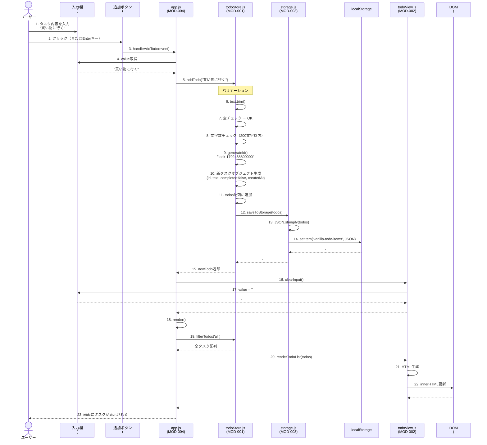
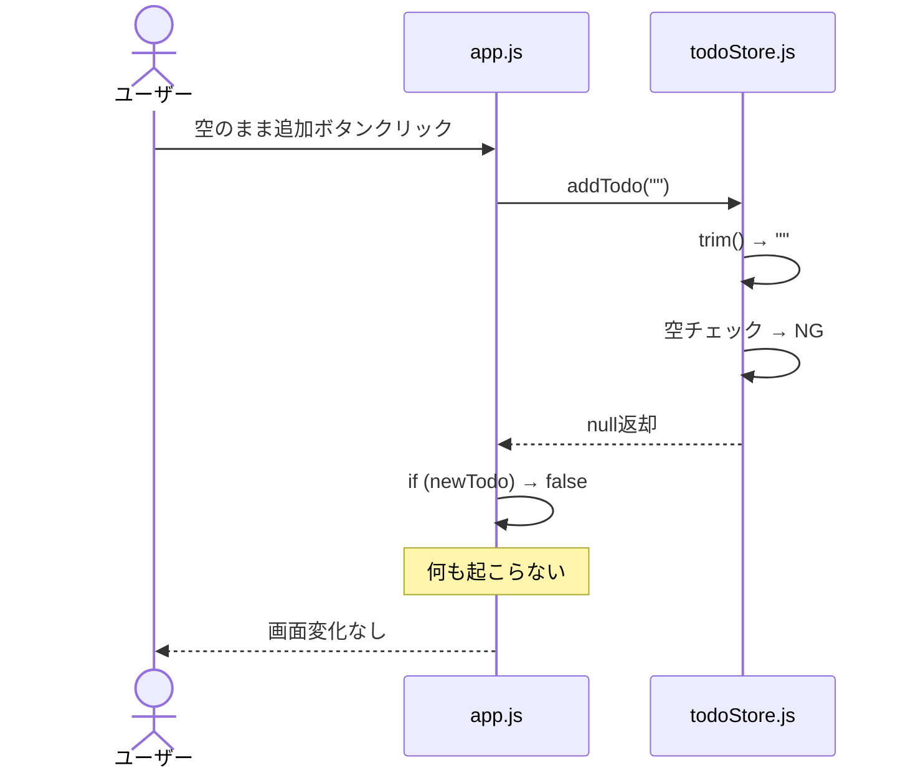
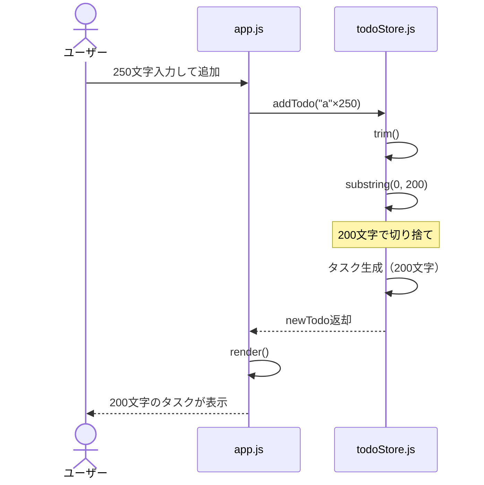

# シーケンス図: SEQ-001 タスク追加処理

## 1. 基本情報

| 項目 | 内容 |
|-----|------|
| シーケンスID | SEQ-001 |
| 処理名 | タスク追加処理 |
| 対応機能 | FNC-001 |
| 対応要件 | FR-001 |
| 対応画面 | SCR-001 |
| 作成日 | 2025-12-13 |
| 更新日 | 2025-12-13 |

---

## 2. 概要

ユーザーがタスクを入力し、追加ボタンをクリック（またはEnterキー押下）したときの処理フローを示す。

---

## 3. シーケンス図



---

## 4. 処理ステップ詳細

| No | 処理内容 | 呼出元 | 呼出先 | 備考 |
|----|---------|-------|-------|------|
| 1 | ユーザーがタスク内容を入力 | - | 入力欄 | 例: "買い物に行く" |
| 2 | 追加ボタンをクリック | ユーザー | ボタン | またはEnterキー押下 |
| 3 | handleAddTodo()実行 | ボタン | app.js | イベントハンドラ |
| 4 | 入力値を取得 | app.js | 入力欄 | inputElement.value |
| 5 | addTodo()呼び出し | app.js | todoStore.js | テキストを渡す |
| 6 | 前後空白除去 | todoStore.js | - | text.trim() |
| 7 | 空チェック | todoStore.js | - | trim後が空なら処理中断 |
| 8 | 文字数チェック | todoStore.js | - | 201文字以上は切り捨て |
| 9 | ID生成 | todoStore.js | - | "task-" + Date.now() |
| 10 | タスクオブジェクト生成 | todoStore.js | - | id, text, completed, createdAt |
| 11 | todos配列に追加 | todoStore.js | - | todos.push(newTodo) |
| 12 | localStorage保存 | todoStore.js | storage.js | saveTodos Storage() |
| 13 | JSON変換 | storage.js | - | JSON.stringify() |
| 14 | localStorage書き込み | storage.js | localStorage | setItem() |
| 15 | 新タスクを返却 | todoStore.js | app.js | newTodo |
| 16 | 入力欄クリア | app.js | todoView.js | clearInput() |
| 17 | value空にする | todoView.js | 入力欄 | inputElement.value = '' |
| 18 | render()実行 | app.js | - | 画面再描画 |
| 19 | フィルタリング | app.js | todoStore.js | filterTodos('all') |
| 20 | リスト描画 | app.js | todoView.js | renderTodoList() |
| 21 | HTML生成 | todoView.js | - | タスクリストのHTML |
| 22 | DOM更新 | todoView.js | DOM | innerHTML更新 |
| 23 | 画面更新完了 | - | ユーザー | 新タスクが表示される |

---

## 5. データフロー

### 5.1 入力データ

| 項目 | 型 | 値の例 | 取得元 |
|-----|-----|-------|-------|
| text | string | "買い物に行く" | #todo-input.value |

### 5.2 生成データ

| 項目 | 型 | 値の例 | 生成場所 |
|-----|-----|-------|---------|
| id | string | "task-1702468800000" | todoStore.generateId() |
| text | string | "買い物に行く" | 入力値（trim済み） |
| completed | boolean | false | 固定値 |
| createdAt | string | "2025-12-13T10:00:00.000Z" | new Date().toISOString() |

### 5.3 localStorage保存データ

```json
[
  {
    "id": "task-1702468800000",
    "text": "買い物に行く",
    "completed": false,
    "createdAt": "2025-12-13T10:00:00.000Z"
  }
]
```

---

## 6. 例外フロー

### 6.1 空文字入力時



**ステップ詳細:**
1. ユーザーが空のまま追加ボタンをクリック
2. addTodo("")呼び出し
3. trim()後も空文字
4. nullを返却
5. app.jsで`if (newTodo)`がfalseとなり、何も起こらない

### 6.2 201文字以上入力時



---

## 7. パフォーマンス考慮

| 項目 | 内容 |
|-----|------|
| DOM操作回数 | 2回（clearInput, renderTodoList） |
| localStorage書き込み | 1回 |
| JSON.stringify() | 1回 |
| 計算量 | O(n) - タスク数に比例 |

**ボトルネック:**
- タスク数が1000件を超えると、renderTodoList()のinnerHTML更新が遅くなる可能性

---

## 8. エラーハンドリング

| エラー | 発生条件 | 対処 |
|-------|---------|------|
| 空文字入力 | trim()後が空 | nullを返却、画面変化なし |
| localStorage容量超過 | QuotaExceededError | コンソールログ出力、次回保存時に再試行 |
| 予期しないエラー | - | ブラウザのデフォルトエラー処理 |

---

## 9. 関連シーケンス

| シーケンスID | 処理名 | 関連内容 |
|------------|--------|---------|
| SEQ-005 | 初期化処理 | タスク追加後の再描画と同じフロー |

---

## 10. 変更履歴

| 日付 | バージョン | 変更内容 | 変更者 |
|-----|-----------|---------|--------|
| 2025-12-13 | 1.0 | 初版作成 | Claude Code |
