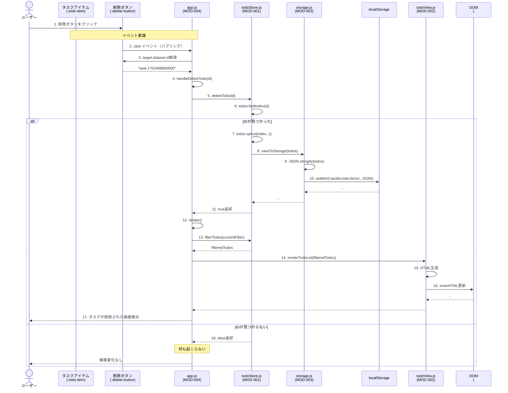
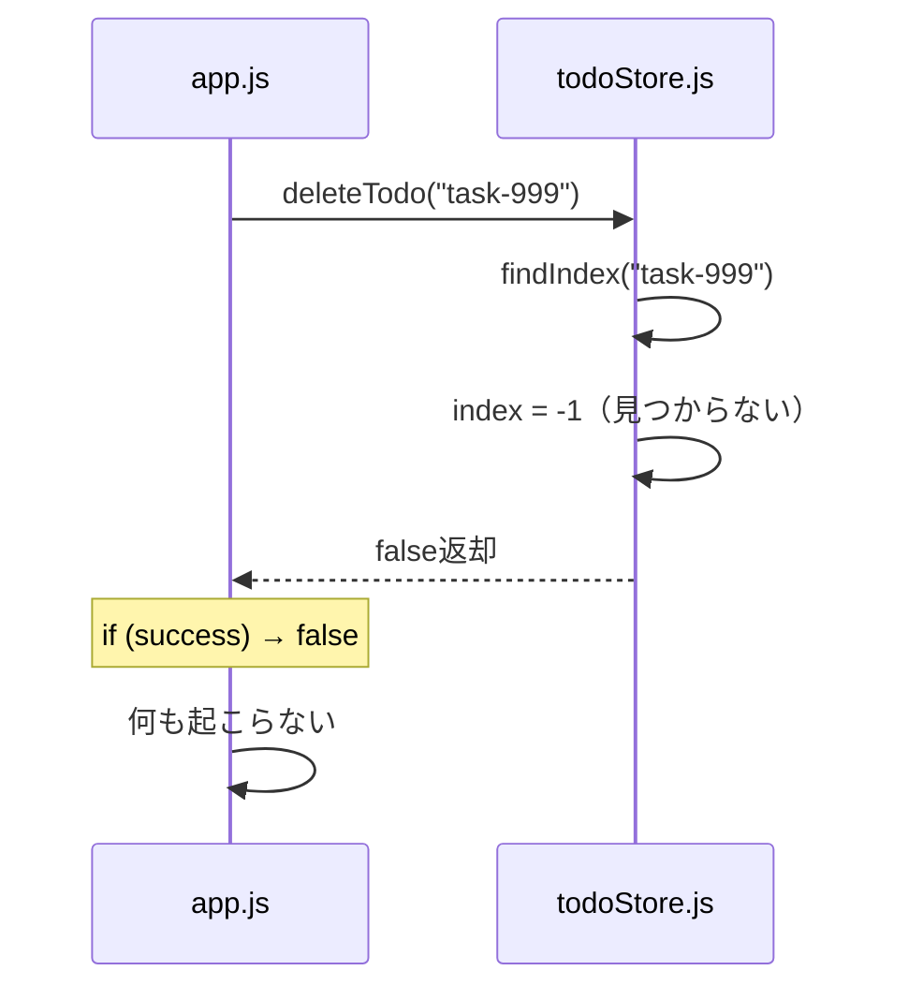

# シーケンス図: SEQ-002 タスク削除処理

## 1. 基本情報

| 項目 | 内容 |
|-----|------|
| シーケンスID | SEQ-002 |
| 処理名 | タスク削除処理 |
| 対応機能 | FNC-002 |
| 対応要件 | FR-002 |
| 対応画面 | SCR-001 |
| 作成日 | 2025-12-13 |
| 更新日 | 2025-12-13 |

---

## 2. 概要

ユーザーがタスクの削除ボタンをクリックしたときの処理フローを示す。

---

## 3. シーケンス図



---

## 4. 処理ステップ詳細

| No | 処理内容 | 呼出元 | 呼出先 | 備考 |
|----|---------|-------|-------|------|
| 1 | 削除ボタンをクリック | ユーザー | 削除ボタン | - |
| 2 | clickイベントがバブリング | 削除ボタン | app.js | イベント委譲で#todo-listが受け取る |
| 3 | data-id属性を取得 | app.js | 削除ボタン | event.target.dataset.id |
| 4 | handleDeleteTodo()実行 | app.js | - | IDを引数に渡す |
| 5 | deleteTodo()呼び出し | app.js | todoStore.js | IDを渡す |
| 6 | 該当IDのインデックスを検索 | todoStore.js | - | findIndex() |
| 7 | 配列から削除 | todoStore.js | - | splice(index, 1) |
| 8 | localStorage保存 | todoStore.js | storage.js | saveToStorage() |
| 9 | JSON変換 | storage.js | - | JSON.stringify() |
| 10 | localStorage書き込み | storage.js | localStorage | setItem() |
| 11 | true返却 | todoStore.js | app.js | 削除成功 |
| 12 | render()実行 | app.js | - | 画面再描画 |
| 13 | フィルタリング | app.js | todoStore.js | filterTodos() |
| 14 | リスト描画 | app.js | todoView.js | renderTodoList() |
| 15 | HTML生成 | todoView.js | - | 削除されたタスクは含まれない |
| 16 | DOM更新 | todoView.js | DOM | innerHTML更新 |
| 17 | 画面更新完了 | - | ユーザー | タスクが消える |

---

## 5. データフロー

### 5.1 入力データ

| 項目 | 型 | 値の例 | 取得元 |
|-----|-----|-------|-------|
| id | string | "task-1702468800000" | event.target.dataset.id |

### 5.2 localStorage保存データ（削除後）

**削除前:**
```json
[
  {"id": "task-1", "text": "タスクA", "completed": false, "createdAt": "..."},
  {"id": "task-2", "text": "タスクB", "completed": false, "createdAt": "..."}
]
```

**削除後（task-1を削除）:**
```json
[
  {"id": "task-2", "text": "タスクB", "completed": false, "createdAt": "..."}
]
```

---

## 6. イベント委譲の詳細

### 6.1 イベント委譲を使う理由

| 項目 | 説明 |
|-----|------|
| パフォーマンス | 各削除ボタンに個別のリスナーを登録しない |
| メモリ効率 | リスナー数が削減される（1つのみ） |
| 動的要素対応 | renderTodoList()で再生成されても自動対応 |

### 6.2 実装方法

```javascript
// 親要素（#todo-list）にリスナーを登録
document.getElementById('todo-list').addEventListener('click', (event) => {
  const target = event.target;

  // 削除ボタンがクリックされたか判定
  if (target.classList.contains('delete-button')) {
    const id = target.dataset.id;
    handleDeleteTodo(id);
  }
});
```

**HTML構造:**
```html
<button class="delete-button" data-id="task-123">削除</button>
```

---

## 7. 例外フロー

### 7.1 存在しないIDを削除しようとした場合



**ステップ詳細:**
1. 存在しないID（"task-999"）で削除を試みる
2. findIndex()が-1を返す
3. deleteTodo()はfalseを返却
4. app.jsで`if (success)`がfalseとなり、再描画されない
5. 画面変化なし

---

## 8. パフォーマンス考慮

| 項目 | 内容 |
|-----|------|
| DOM操作回数 | 1回（renderTodoList） |
| localStorage書き込み | 1回 |
| JSON.stringify() | 1回 |
| findIndex()計算量 | O(n) - タスク数に比例 |

---

## 9. エラーハンドリング

| エラー | 発生条件 | 対処 |
|-------|---------|------|
| 存在しないID | findIndex() = -1 | falseを返却、画面変化なし |
| localStorage保存失敗 | QuotaExceededError等 | コンソールログ出力、次回保存時に再試行 |

---

## 10. 関連シーケンス

| シーケンスID | 処理名 | 関連内容 |
|------------|--------|---------|
| SEQ-001 | タスク追加処理 | render()フローが同じ |
| SEQ-003 | 完了切替処理 | イベント委譲パターンが同じ |

---

## 11. 変更履歴

| 日付 | バージョン | 変更内容 | 変更者 |
|-----|-----------|---------|--------|
| 2025-12-13 | 1.0 | 初版作成 | Claude Code |
